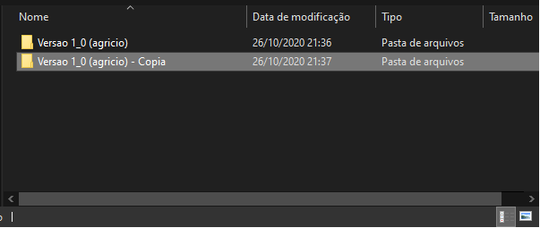

*Projeto Solares - Barcos de Competição, Telemetria e Gerenciamento Energético*

# Política de Uso - Hardware T.G.E

Neste documento serao explicitadas políticas de uso para o repositório de hardware da Telemetria e Gerenciamento Energético.

## Branches

Tarefas de pesquisa e projeto de circuitos são feitas no branch develop. Caso julgue necessário é permitida a criação de novos branches, contanto que seja justificável. Os produtos amplamente testados são levados para o branch **Master**.
## Pulls

Antes de iniciar o trabalho **sempre faça pull no repositório** a fim de garantir que estará utilizando a versão mais recente e, com isso, diminuir as chances de conflitos.

## Commits

### Circuitos Separados e Simulacoes
Commits de circuitos separados e simulações devem ser feitos nas pastas de subcircuitos e simulacoes (dentro da pasta _Base Material_). Estes commits sao livres de **políticas do editor atual** (será tratada neste texto).

### Materiais de Apoio
Materiais como datasheets, imagens e links de refêrencia podem sofrer commits sem **políticas do editor atual**.

### Alterações no Circuito Principal

Sempre que se pretender alterar o circuito principal é necessário:
1. Criar uma cópia da pasta da última versão do projeto:

2. À pasta cópia deve ser atribuída um nome com nova versão (alterando o algarismo decimal) em que o nome do editior é adicionado ao nome da pasta juntamente com a frase "editando".

>  /Versao 1_01 (lorem - editando)

3. A nova pasta com a frase "editando" deve ser commitada antes que as alterações comecem a ser feitas.
_Obs: O nome do último editor deve ser mantido na pasta_

Cumprindo estes passos, outros participantes saberão quando os arquivos estiverem sendo editados e as versões anteriores não estarão em risco.